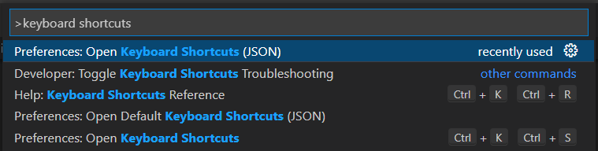
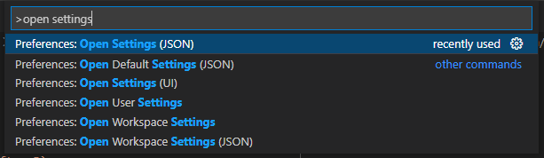

# Visual Studio Code tips

## Default keyboard shortcuts

### General

- Open Command pallette: `Ctrl + Shift + P`
- Open folder: `Ctrl + K, Ctrl + O`
- Open recent: `Ctrl + R`. It's known that the `npm` extension redefines this
shortcut, uninstall or disable it if neccessary.

### Display

- Toggle fullscreen: `F11`
- Toggle zen mode: `Ctrl + K Z` (shows only the current editor in fullscreen).

### Editor

- Copy current line: `Ctrl + C` (without making a selection).
- Cut current line: `Ctrl + X` (without making a selection).
- Copy line up: `Shift + Alt + Up Arrow`
- Copy line down: `Shift + Alt + Down Arrow`
- Create new line below: `Ctrl + Enter`
- Create new line above: `Ctrl + Shift + Enter`
- Move a line up: `Alt + Up Arrow`
- Move a line down: `Alt + Down Arrow`
- Go to symbol: `Ctrl + Shift + O`. This is very useful for navigating the
source code symbols, Markdown headings...

### Tabs

- Move to previous tab: `Ctrl + PgUp`
- Move to next tab: `Ctrl + PgDown`
- Select tab from list: `Ctrl + Tab`
- Close tab: `Ctrl + W`

### Panels

- Toggle Explorer: `Ctrl + B` or `Ctrl + 0`
- Open preview panel: `Ctrl + K, V`
- Open preview tab: `Ctrl + Shift + V`
- Toggle terminal: ``Ctrl + ` ``
- Move to Explorer: `Ctrl + 0`
- Move to Editor: `Ctrl + 1`
- Move to Preview: `Ctrl + 2`

## Custom keyboard shortcuts

To open keyboard shortcuts JSON file, open Command pallette with
`Ctrl + Shift + P`, type `keyboard shortcuts` and select the JSON option, as
shown below:



and VS Code will open a `keybindings.json` for editing.

### Open and focus to the Outline panel

Use `Ctrl + Alt + O` to focus to the Outline panel. If the Outline panel is
hidden, it will be open. This shortcut works when the focus is in an editor.

Put this into `keybindings.json` (requires `multi-command` extension):

```json
	{
		"key": "ctrl+alt+o",
		"command": "extension.multiCommand.execute",
		"args": {
			"sequence": [
				"outline.focus",
				"outline.focus",
				"outline.focus"
			]
		},
		"when": "editorTextFocus"
	}
```

### Toggle word wrap

Use `Shift + Alt + W` to toggle word wrap instead of `Alt + Z` to avoid conflict with `Unikey`.

```json
	{
		"key": "shift+alt+w",
		"command": "editor.action.toggleWordWrap"
	},
	{
		"key": "alt+z",
		"command": "-editor.action.toggleWordWrap"
	},
```

### Join lines

Use `Ctrl + J` to join lines, just like in Vim. This override Open Panel command, which is not frequently used.

```json
	{
		"key": "ctrl+j",
		"command": "editor.action.joinLines"
	},
	{
		"key": "ctrl+j",
		"command": "-workbench.action.togglePanel"
	},
```

## Essential settings

To open JSON settings, open the Command pallette with `Ctrl + Shift + P`, type
`open settings` and choose the action from the dropdown, as shown in the picture
below:

  

Set these settings using VS Code UI with `Ctrl + ,` or `settings.json`:

```json
	"editor.insertSpaces": false,
	"editor.tabSize": 2,
	"editor.rulers": [ 80	],
```

## Useful extensions

### [Multi-command by ryuta46](https://marketplace.visualstudio.com/items?itemName=ryuta46.multi-command)

This is a MUST HAVE extension.

### [Todo Tree by Gruntfuggly](https://marketplace.visualstudio.com/items?itemName=Gruntfuggly.todo-tree)

MUST HAVE extension!

Put this in `settings.json` to define tags:

```json
	"todo-tree.regex.regexCaseSensitive": true,
	"todo-tree.general.tags": [
		"BUG",
		"HACK",
		"FIXME",
		"TODO",
		"XXX",
		"WIP",
		"IDEA",
		"NOTE",
		"THINK"
	],
```

This helps put all of my personal notes into the Todo tree so I can quickly jump
to review them.

### [markdownlint by David Anson](https://marketplace.visualstudio.com/items?itemName=DavidAnson.vscode-markdownlint)

Should include this `.markdownlint.json` to ignore code blocks while linting:

```json
{
	"MD010": {
		"code_blocks": false
	},
	"MD013": {
		"code_blocks": false
	}
}
```

Or put this section into VS Code's User or Workbench's `settings.json`:

```json
	"markdownlint.config": {
		"default": true,
		"MD010": {
			"code_blocks": false
		},
		"MD013": {
			"code_blocks": false
		}
	},
```

### [Markdown Image by Hancel.Lin](https://marketplace.visualstudio.com/items?itemName=hancel.markdown-image)

This is a amazing extension, which allows pasting image directly from clipboard,
and automatically create a `./images` directory at the same locatin as the
markdown file, then put the pasted image there in PNG format, with a name after
the picture's hash, such as
`fed088fc9006b5fc692d4403c4ef70c8f283aac4f6257a0407a7b0f46c01c237.png`

### [Highlight by Fabio Spampinato](https://marketplace.visualstudio.com/items?itemName=fabiospampinato.vscode-highlight)

This extension automatically highlight texts such as notes, todos, bugs...

The highlight text should be put between block comment markers such as "/*...*/".

Standalone text will not be highlighted. Highlight text must be inside another text, that's why it needed to be highlighted.

Put this in `settings.json` to highlight:

- TODO: yellow
- FIXME|FIX|BUG|UGLY|DEBUG|HACK: dark red.
- REVIEW|OPTIMIZE|TSC: cyan.
- IDEA|NOTE|THINK: medium orchid.

```json
"highlight.regexes": {
		"((?:<!-- *)?(?:#|// @|//|./\\*+|<!--|--|\\* @|{!|{{!--|{{!) *TODO(?:\\s*\\([^)]+\\))?:?)((?!\\w)(?: *-->| *\\*/| *!}| *--}}| *}}|(?= *(?:[^:]//|/\\*+|<!--|@|--|{!|{{!--|{{!))|(?: +[^\\n@]*?)(?= *(?:[^:]//|/\\*+|<!--|@|--(?!>)|{!|{{!--|{{!))|(?: +[^@\\n]+)?))": {
			"filterFileRegex": ".*(?<!CHANGELOG.md)$",
			"decorations": [
				{
					"overviewRulerColor": "#ffcc00",
					"backgroundColor": "#ffcc00",
					"color": "#1f1f1f",
					"fontWeight": "bold"
				},
				{
					"backgroundColor": "#ffcc00",
					"color": "#1f1f1f"
				}
			]
		},
		"((?:<!-- *)?(?:#|// @|//|./\\*+|<!--|--|\\* @|{!|{{!--|{{!) *(?:FIXME|FIX|BUG|UGLY|DEBUG|HACK)(?:\\s*\\([^)]+\\))?:?)((?!\\w)(?: *-->| *\\*/| *!}| *--}}| *}}|(?= *(?:[^:]//|/\\*+|<!--|@|--|{!|{{!--|{{!))|(?: +[^\\n@]*?)(?= *(?:[^:]//|/\\*+|<!--|@|--(?!>)|{!|{{!--|{{!))|(?: +[^@\\n]+)?))": {
			"filterFileRegex": ".*(?<!CHANGELOG.md)$",
			"decorations": [
				{
					"overviewRulerColor": "#cc0000",
					"backgroundColor": "#cc0000",
					"color": "#1f1f1f",
					"fontWeight": "bold"
				},
				{
					"backgroundColor": "#cc0000",
					"color": "#1f1f1f"
				}
			]
		},
		"((?:<!-- *)?(?:#|// @|//|./\\*+|<!--|--|\\* @|{!|{{!--|{{!) *(?:REVIEW|OPTIMIZE|TSC)(?:\\s*\\([^)]+\\))?:?)((?!\\w)(?: *-->| *\\*/| *!}| *--}}| *}}|(?= *(?:[^:]//|/\\*+|<!--|@|--|{!|{{!--|{{!))|(?: +[^\\n@]*?)(?= *(?:[^:]//|/\\*+|<!--|@|--(?!>)|{!|{{!--|{{!))|(?: +[^@\\n]+)?))": {
			"filterFileRegex": ".*(?<!CHANGELOG.md)$",
			"decorations": [
				{
					"overviewRulerColor": "#00ccff",
					"backgroundColor": "#00ccff",
					"color": "#1f1f1f",
					"fontWeight": "bold"
				},
				{
					"backgroundColor": "#00ccff",
					"color": "#1f1f1f"
				}
			]
		},
		"((?:<!-- *)?(?:#|// @|//|./\\*+|<!--|--|\\* @|{!|{{!--|{{!) *(?:IDEA|NOTE|THINK)(?:\\s*\\([^)]+\\))?:?)((?!\\w)(?: *-->| *\\*/| *!}| *--}}| *}}|(?= *(?:[^:]//|/\\*+|<!--|@|--|{!|{{!--|{{!))|(?: +[^\\n@]*?)(?= *(?:[^:]//|/\\*+|<!--|@|--(?!>)|{!|{{!--|{{!))|(?: +[^@\\n]+)?))": {
			"filterFileRegex": ".*(?<!CHANGELOG.md)$",
			"decorations": [
				{
					"overviewRulerColor": "#ba55d3",
					"backgroundColor": "#ba55d3",
					"color": "#1f1f1f",
					"fontWeight": "bold"
				},
				{
					"backgroundColor": "#ba55d3",
					"color": "#1f1f1f"
				}
			]
		}
	},
```

### [Markdown Preview Enhanced by Yiyi Wang](https://marketplace.visualstudio.com/items?itemName=shd101wyy.markdown-preview-enhanced)

A MUST HAVE, amazing extension for Markdown documents. Right-click on the
preview to access more functionalities such as open in browser, export to PDF,
changing preview theme (especially GitHub themes)...

### [Git Graph by mhutchie](https://marketplace.visualstudio.com/items?itemName=mhutchie.git-graph)

A MUST HAVE extension for working with Git in VS Code. It adds a button in Source Control panel to show a project's Git commits graphs.
