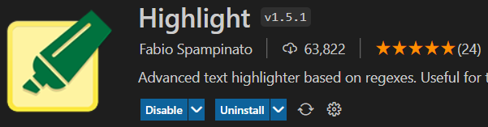

# Visual Studio Code tips

## Shortcut keys

### General

- Open Command pallette: `Ctrl + Shift + P`
- Open folder: `Ctrl + K, Ctrl + O`
- Open recent: `Ctrl + R`

### Display

- Toggle fullscreen: `F11`
- Toggle zen mode: `Ctrl + K Z` (shows only the current editor in fullscreen).

### Editor

- Copy current line: `Ctrl + C` (without making a selection).
- Cut current line: `Ctrl + X` (without making a selection).
- Copy line up: `Shift + Alt + Up Arrow`
- Copy line down: `Shift + Alt + Down Arrow`
- Create new line below: `Ctrl + Enter`
- Create new line above: `Ctrl + Shift + Enter`
- Move a line up: `Alt + Up Arrow`
- Move a line down: `Alt + Down Arrow`

### Tabs

- Move to previous tab: `Ctrl + PgUp`
- Move to next tab: `Ctrl + PgDown`
- Select tab from list: `Ctrl + Tab`
- Close tab: `Ctrl + W`

### Panels

- Toggle Explorer: `Ctrl + B` or `Ctrl + 0`
- Open preview panel: `Ctrl + K, V`
- Open preview tab: `Ctrl + Shift + V`
- Toggle terminal: ``Ctrl + ` ``
- Move to Explorer: `Ctrl + 0`
- Move to Editor: `Ctrl + 1`
- Move to Preview: `Ctrl + 2`

## Useful extensions

### markdownlint by David Anson

Link [here](https://marketplace.visualstudio.com/items?itemName=DavidAnson.vscode-markdownlint).

Should include this `.markdownlint.json` to ignore code blocks while linting:

```json
{
	"MD010": {
		"code_blocks": false
	},
	"MD013": {
		"code_blocks": false
	}
}
```

### Markdown Image by Hancel.Lin

  

This is a amazing extension by Hancel.Lin, which can be found
[here](https://marketplace.visualstudio.com/items?itemName=hancel.markdown-image).
It allows pasting image directly from clipboard, and automatically create a
`./images` directory at the same locatin as the markdown file, and put the
pasted image there in PNG format, with a name after the picture's hash, such as
`fed088fc9006b5fc692d4403c4ef70c8f283aac4f6257a0407a7b0f46c01c237.png`

### Highlight by Fabio Spampinato

  
This extension automatically highlight texts such as notes, todos, bugs... It
can be found [here](https://marketplace.visualstudio.com/items?itemName=fabiospampinato.vscode-highlight).
